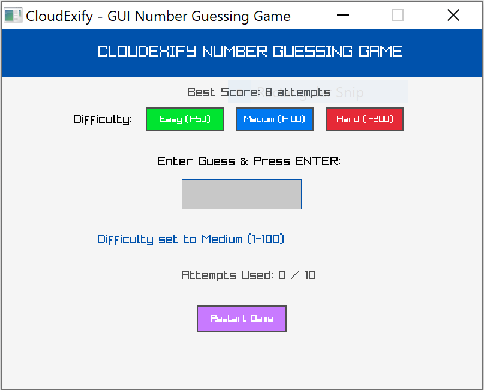
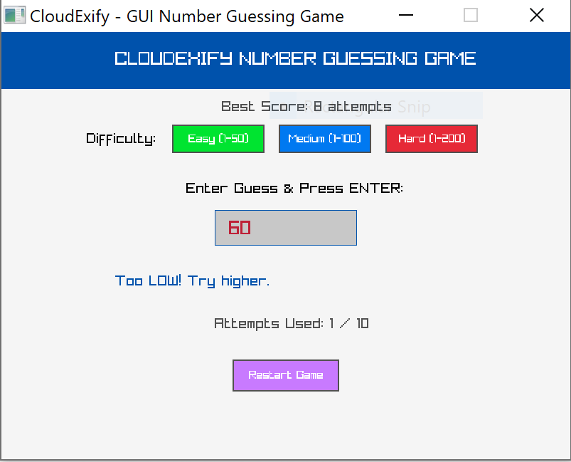
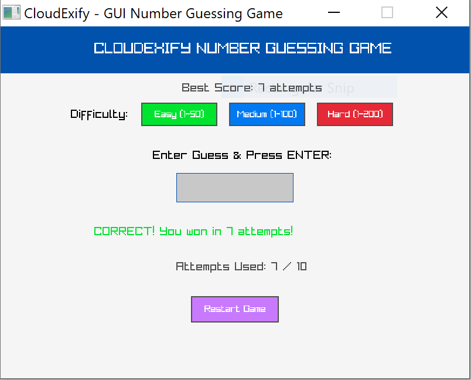
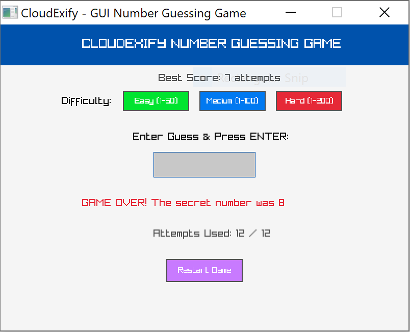

 🎯 CloudExify C++ Internship - Project 1: Number Guessing Game (GUI)

 📌 Project Overview
Welcome to my Project 1 submission for the CloudExify Summer Internship 2026.
Instead of a simple command-line interface, this project is built as a **full Graphical User Interface (GUI)** application using **C++** and **Raylib**.

------------

 👤 Developer Info
- Name: Minahil nizam
- Registration Number: CX-INT-2026-CPP-0347
- Language: C++ 
- Graphics Library: Raylib
- Compiler: MinGW GCC (Code::Blocks 25.03)

------------

 ✨ Key Features & Enhancements
- Interactive GUI Window: Clean visual design with buttons, text input box, and real-time status display.
- Multiple Difficulties: Easy (1-50), Medium (1-100), and Hard (1-200) mode.
- Persistent High Score: Dynamic save/load system using file I/O (`bestscore.txt`) to remember your top score.
- Warmer / Colder Feedback: Dynamic hints that tell the player if their latest guess is closer or farther from the target.
- Attempt Limits: Maximum guess count enforced depending on the selected difficulty.
- Safe Input Validation: Handles invalid inputs cleanly without crashing or wasting attempt count.

-----------

 🕹️ How to Run
1. Clone or download this repository.
2. Open the project in Code::Blocks.
3. Make sure "Raylib" is linked in your build options.
4. Press "F9" to build and run!

-----------

 📸 Screenshots

